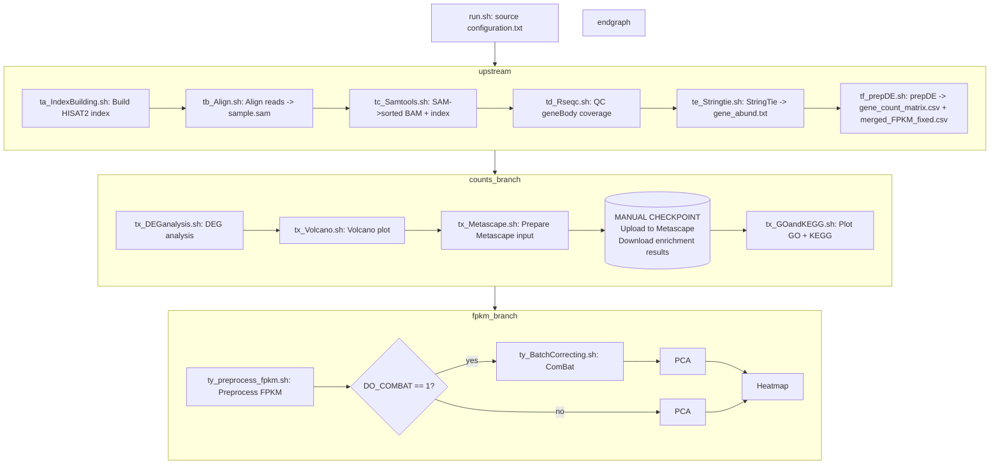

```mermaid
flowchart TD
  A[run.sh: source configuration.txt] --> U

  subgraph U[upstream]
    U1[ta_IndexBuilding.sh: Build HISAT2 index] --> 
    U2[tb_Align.sh: Align reads -> sample.sam] -->
    U3[tc_Samtools.sh: SAM->sorted BAM + index] -->
    U4[td_Rseqc.sh: QC geneBody coverage] -->
    U5[te_Stringtie.sh: StringTie -> gene_abund.txt] -->
    U6[tf_prepDE.sh: prepDE -> gene_count_matrix.csv + merged_FPKM_fixed.csv]
  end

  U --> C

  subgraph C[counts_branch]
    C1[tx_DEGanalysis.sh: DEG analysis] -->
    C2[tx_Volcano.sh: Volcano plot] -->
    C3[tx_Metascape.sh: Prepare Metascape input] -->
    M[(MANUAL CHECKPOINT<br/>Upload to Metascape<br/>Download enrichment results)] -->
    C4[tx_GOandKEGG.sh: Plot GO + KEGG]
  end

  C --> F

  subgraph F[fpkm_branch]
    F1[ty_preprocess_fpkm.sh: Preprocess FPKM] -->
    D{DO_COMBAT == 1?}
    D -- yes --> F2[ty_BatchCorrecting.sh: ComBat] --> F3[PCA]
    D -- no --> F3b[PCA]
    F3 --> F4[Heatmap]
    F3b --> F4
  end
endgraph
```